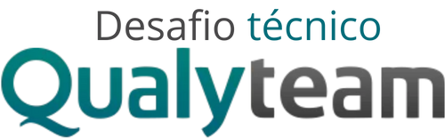

# 

Esse projeto foi criado em resposta a um desafio técnico para processo seletivo na Qualyteam.

O enunciado com os requisitos se encontra em [DesafioQualyteam.Docs](./DesafioQualyTeam.Docs/).
  
___
  
## Principais Tecnologias Usadas

- ASP.Net
  - .Net 6
  - C# 10
- Angular 14
- MySql 8 (via docker)  
